# Database Development with Pl/Sql First Assignment

## Overview (Shool Library)

This project demonstrates practical mastery of **SQL JOINs** and **SQL Window Functions** using a **School Library** as the business scenario.

---

## Step 1: Problem Definition

### Business Context

A school library within a secondary education institution. The analysis is conducted by the Library Administration Department in the education sector.

### Data Challenge

The school library maintains separate records for members, books, and borrowing transactions. Librarians lack clear insight into which books are most frequently borrowed, how borrowing activity changes over time, and how actively different members use library resources.

### Expected Outcome

Identify the most borrowed books, analyze borrowing trends over time, and segment library members based on activity levels to support book purchasing decisions and improve student engagement.

---

## Step 2: Success Criteria

1.Identify the top 5 most borrowed books based on total borrow count
→ RANK()

2.Calculate the running monthly total of book borrowings over time
→ SUM() OVER()

3.Measure month-over-month changes in borrowing activity to detect increases or decreases in library usage
→ LAG() / LEAD()

4.Segment library members into four activity quartiles based on total number of books borrowed
→ NTILE(4)

5.Compute the three-month moving average of total borrowings to smooth short-term fluctuations and identify borrowing trends
→ AVG() OVER()

## Step 3: Database Schema Design

The below screenshots shows both sql querry and the result(ER Diagram using dbdiagram.io)

THE following two screenshots shows the main 3 points

1.One member can have many borrowings
2.One book can appear in many borrowings
3.Each borrowing record links one member to one book

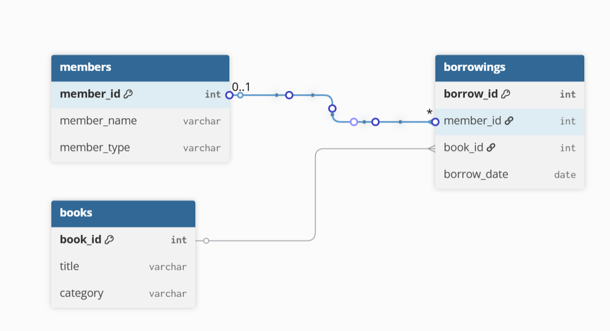
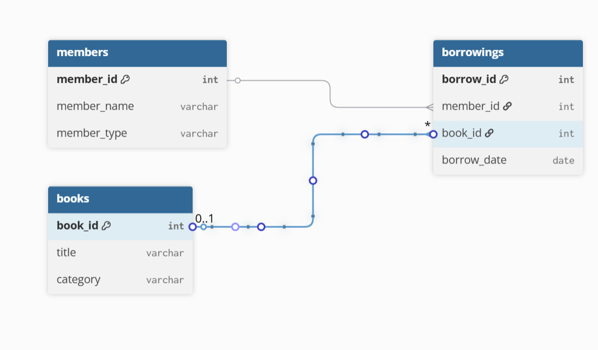

## Step 4: Part A — SQL JOINs Implementation

All JOIN queries were executed in MySQL using the schema defined above. Screenshots are shown below:

### INNER JOIN

#### SQL query with comments

#### But before applying inner join or any other, you first create tables and insert the values as it is shown in the screenshots below:

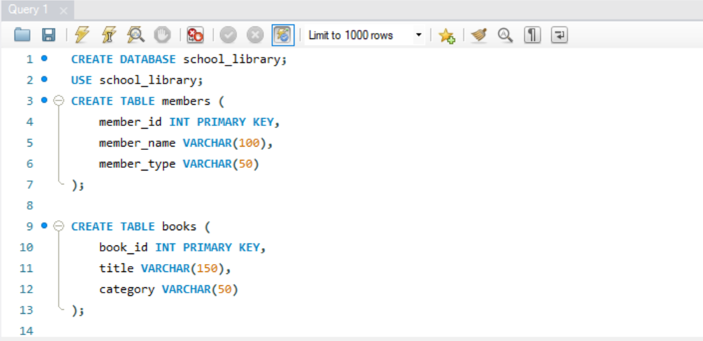

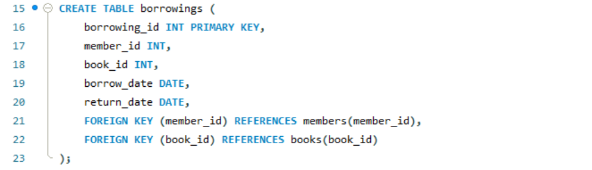

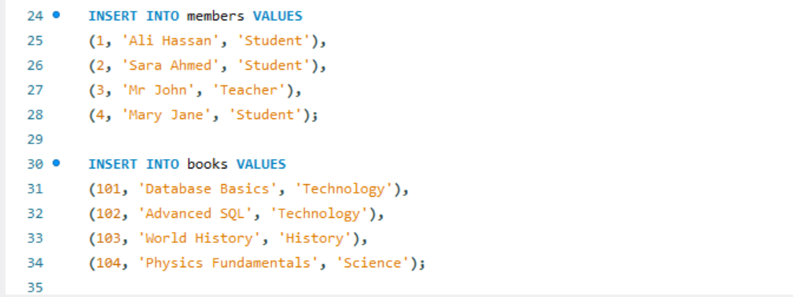

#### Result

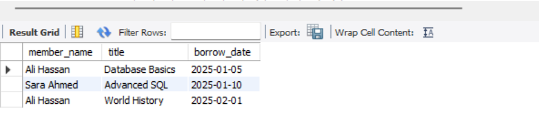

#### Business interpretation

## This query returns only valid borrowing records where both the member and the book exist. It ensures the library analyzes accurate transaction data for reporting and decision-making.

### LEFT JOIN

#### SQL query with comments

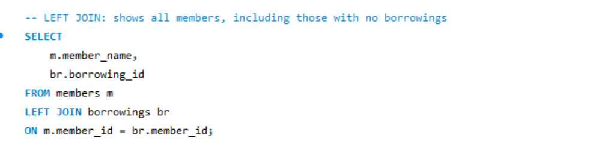

#### Result

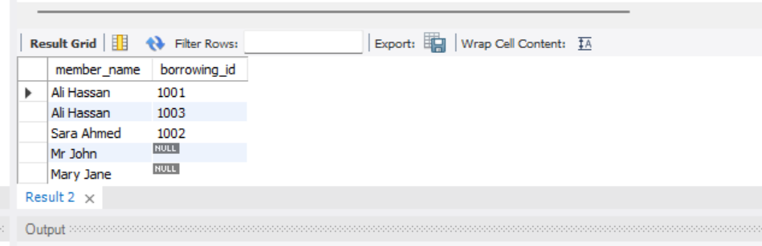

#### Business interpretation

This query identifies members with no borrowing history. Librarians can use this information to encourage greater library usage among inactive students or staff.

---

### RIGHT JOIN

#### SQL query with comments

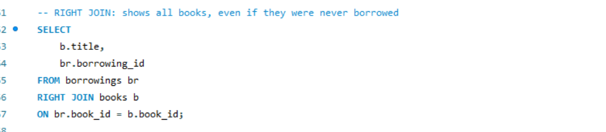

#### Result

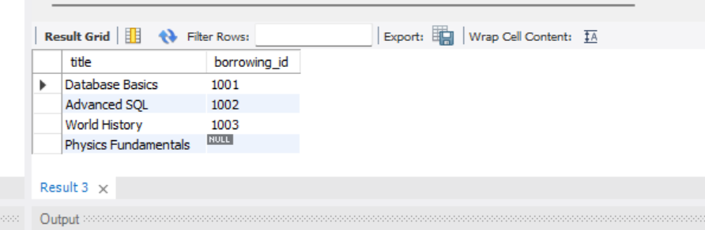

#### Business interpretation

This query highlights books that have never been borrowed. These books may be outdated, misplaced, or candidates for replacement or promotion.

---

### FULL OUTER JOIN

#### SQL query with comments

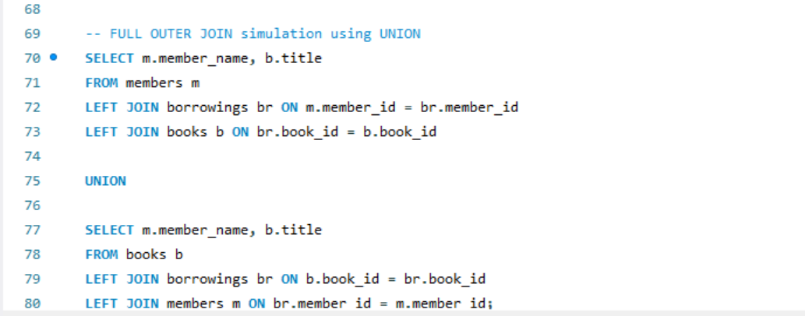

#### Result

##### Business interpretation

## This query provides a complete overview of library members and books, including inactive members and unused books. It helps the library understand overall resource utilization.

### SELF JOIN

#### SQL query with comments

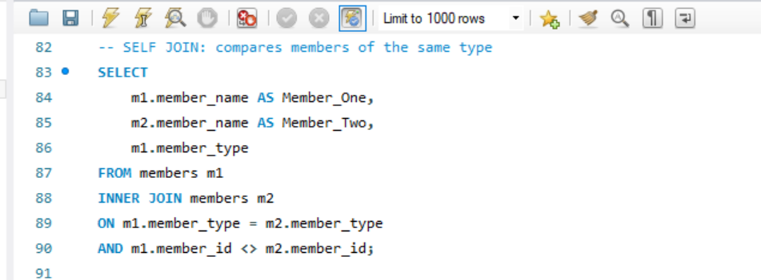

#### Result

#### Business interpretation

## This query compares members belonging to the same group (students or teachers). It supports group-level analysis of library engagement.

## Step 5: Part B — Window Functions Implementation

### Ranking Functions

#### SQL query with comments

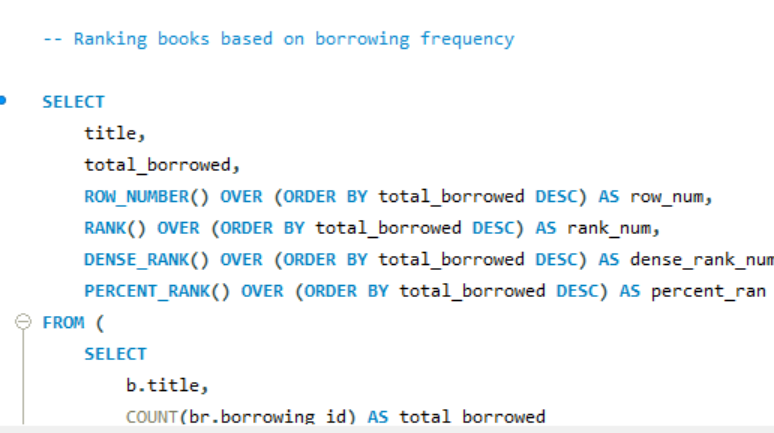

#### Result

#### Business interpretation

This query ranks books based on how frequently they are borrowed. It helps identify the most popular books in the library.

---

### Aggregate Window Functions

#### SQL query with comments

#### Result

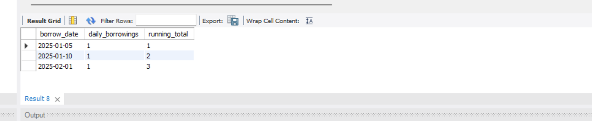

#### Business interpretation

## This query shows cumulative borrowing activity over time. It helps the library track growth in usage.

### Navigation Functions

#### SQL query with comments

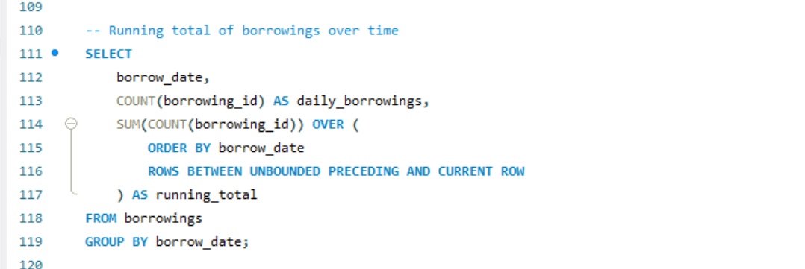

#### Result

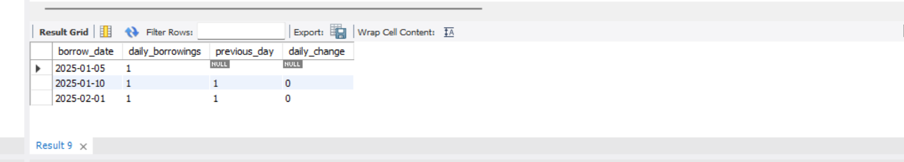

#### Business interpretation

This query compares borrowing activity between time periods. It helps identify increases or decreases in library usage.

---

### Distribution Functions

#### SQL query with comments

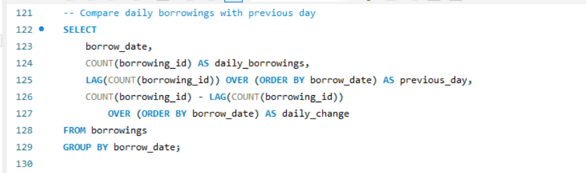

#### Result

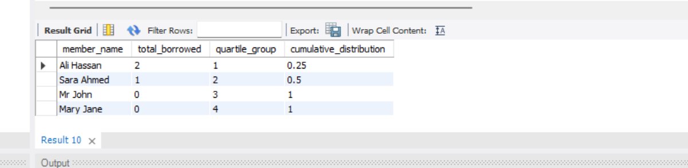

#### Business interpretation

## This query groups members into four activity levels based on borrowing frequency. It helps the library identify highly active and less active members.

## Key Insights

- A small number of books account for most borrowing activity
- Several books have never been borrowed
- Some members are highly active while others are completely inactive
- Borrowing behavior varies significantly by member type

---

## Step 7: Results Analysis

### Descriptive Analysis (What happened?)

The analysis shows that some books are borrowed more frequently than others, indicating varying levels of demand within the school library. A small group of members accounts for most borrowing activity, while some members have never borrowed any books. Additionally, several books have no borrowing records, suggesting low usage.

### Diagnostic Analysis (Why did it happen?)

Popular books tend to belong to academic or technology-related categories, which are more relevant to students’ coursework. Members who borrow frequently are likely students or teachers with regular academic needs. Books with no borrowing activity may be outdated, less relevant to the curriculum, or poorly promoted within the library.

### Prescriptive Analysis (What should be done next?)

## The library should increase the availability of high-demand books and consider acquiring additional copies. Low-usage books should be reviewed for replacement, relocation, or promotion. Targeted engagement strategies, such as reading programs or recommendations, could encourage inactive members to make greater use of library resources.

## References

- [MySQL 8.0 Documentation for Joins](https://dev.mysql.com/doc/refman/8.0/en/join.html)
- [ MySQL 8.0 Documentation for Functions](https://dev.mysql.com/doc/refman/8.0/en/window-functions.html)
- [W3Schools/SQL JOINs Tutorial. ](https://www.w3schools.com/sql/sql_join.asp)
- [W3Schools/SQL window_functions Tutorial. ](https://www.w3schools.com/sql/sql_window_functions.asp)

---

## Other Used Screenshots

### Customer Segmentation Based on borrowing Activities

Querry

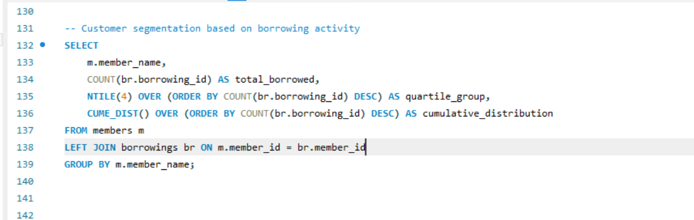

Result

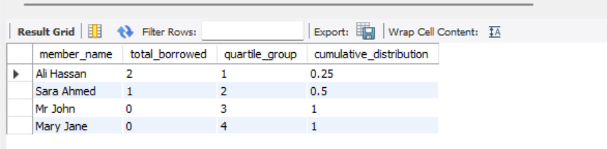

### Outputs got when running querries

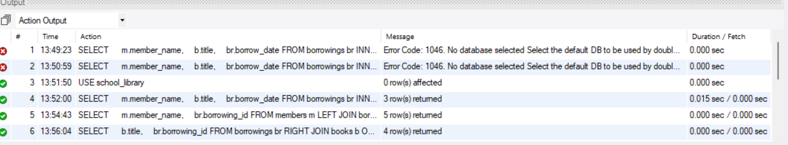

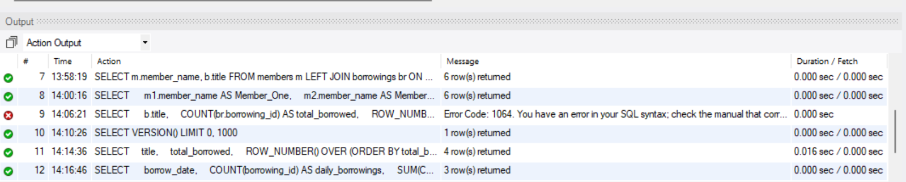

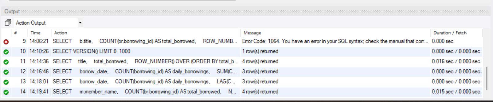

### The whole page of MYSQL

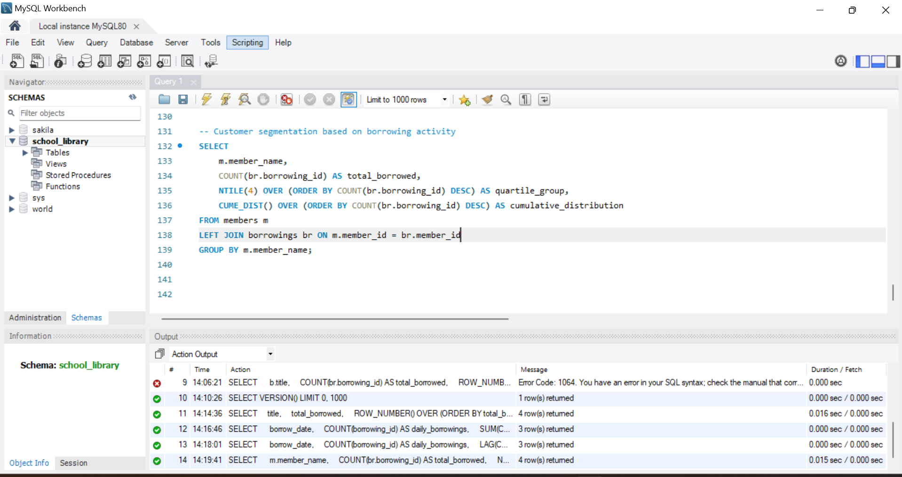

All sources were properly cited. Implementations and analysis represent original work. No AI generated content was copied without attribution or adaptation.
